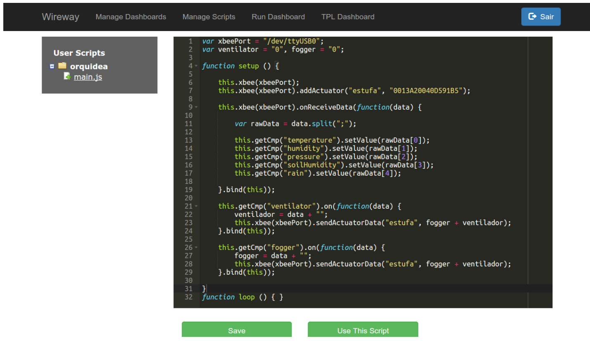

# Embedded Programming projects

This repository aims to integrate all my projects done related to embedded programming.

## [Wireway](wireway)

This was developed as part of my final course project to graduate as a B.Sc. in Information Technology.
The general idea of the project was to enable developers without much knowledge on embedded-systems to program
their Arduino boards through an online Web-editor using a high-level JavaScript API. 

In principle, you would buy a pre-programmed board with the capability to receive commands from a WebServer.
Once logged on this WebServer you can scan and register your brand new board and start programming it.
The programming was abstract with a high-level API in JavaScript capable of talking to your board through the pre-installed firmware.
The image below shows an example of a web-programmed board.

Given the code for your board is ready and uploaded to your Arduino board, after that you could open up your boards dashboards
and actuate controllers by sending signals from the WebApp and reading values from sensors shown on the screen.
The image below shows an example of the previously programmed board being controlled.

## [Line Follower Robot](line_follower_robot)

The line follower project was developed with the intention to participate on the RoboCore Winter Challenge event.
The codes stored in the `line_follower_robot` folder were the ones used on the championship.
You can see an example of the robot performing by watching the video below:

More details about the algorithm and calculations can be found on the following links:
* [Algorithm](line_follower_robot/line_follower_15_seconds_PID.ino)
* [Calculations project](line_follower_robot/ROBOCORE%20Winter/FollowLine-Final.pdf)